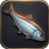
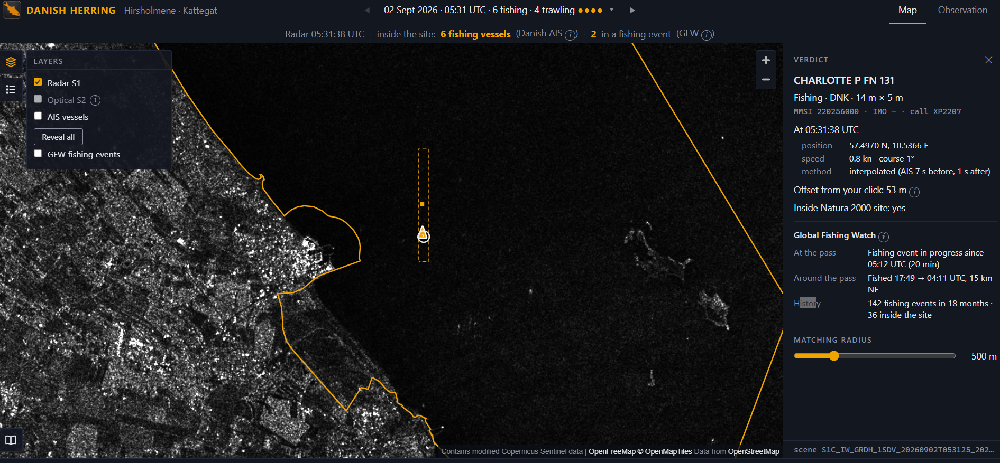

<p align="center">
  
</p>

# Danish Herring

**A game about finding fishing boats in a protected sea — built by crossing satellite radar, official AIS and Global Fishing Watch over one Natura 2000 site in Denmark.**



**Live:** [herring-eight.vercel.app](https://herring-eight.vercel.app/)

---

## Why I built this

I built this for two reasons: to get my hands on geospatial data, and to learn how to build software by directing an AI rather than typing every line. The brief I set myself was simple to state and hard to do — pull meaningful information out of data sources that were never designed to work together.

The use case came from two things I care about. I'm fascinated by what the new generation of space companies makes possible, and I care about animal protection. Fisheries control is exactly where those two meet.

I also wanted a project I could defend in an interview: not a tutorial, but a problem I chose, measured, and got wrong a few times on the way.

## What it does

Hirsholmene is a scatter of islands off Frederikshavn, on Denmark's Kattegat coast — a seal and seabird reserve, and a Natura 2000 site protected under European law. It is also trawled. That isn't a secret: the designation protects habitats and species, but fishing is regulated separately, and for most of Europe's marine sites nobody has ever restricted it. Campaigners call these *paper parks*.

The app puts you in front of a radar image of that site at a precise second and asks you to find the boats. Click a bright dot, and three records that were never designed to meet — Copernicus Sentinel-1 radar, the Danish Maritime Authority's official AIS log, and Global Fishing Watch's classified fishing events — tell you which vessel it was, what it was doing, and whether anyone had noticed. The app walks you through it on first visit.

A second tab, **Observation**, asks the bigger question: how often do satellites actually look at a protected sea? For Hirsholmene, every 1.7 days. For a UNESCO World Heritage site in West Africa, every 12.

## A note on intent

This project is inspired by what Global Fishing Watch already does very well. There is no new concept here. What I've done is zoom in very precisely on one site, add a data source they don't use — the Danish Maritime Authority's shore-based AIS, which is denser than satellite AIS — and present it my own way, with an educational bent.

The fishing shown here is, as far as public records indicate, **legal**. Nothing in this project accuses any vessel or person of anything. Vessel names and identifiers are what the vessels themselves broadcast by radio, and what the Danish authorities and Global Fishing Watch publish openly. Its purpose is entirely educational.

## What the data says

Every number below was measured with the scripts in `data/`.

- **209** Sentinel-1 radar passes over Hirsholmene in a year, versus **31** over the core of the Bijagós Archipelago in Guinea-Bissau — same test, same size of target. The Bijagós median and longest gap are both exactly 12.0 days: one satellite, one track, once per repeat cycle.
- **15 fishing vessels** inside a 95 km² protected site on a single day; **6 inside at the instant** of the 2 September pass, four of them at trawling speed.
- **293 apparent-fishing events by 45 vessels** inside the site in 18 months, every one tagged by Global Fishing Watch as occurring inside a marine protected area. **94% Danish-flagged.** This is the domestic fleet fishing a domestic protected site.
- A four-day fishing trip goes entirely unseen by radar **9%** of the time at Hirsholmene and **66%** of the time at the Bijagós.

## What it cannot do

- **Resolution.** Sentinel-1 is ~10 m per pixel. A 200 m tanker is 20 pixels; a 30 m fishing boat is 3. The app is structurally blind to the vessels most likely to be running dark.
- **The offset is real.** A moving vessel appears displaced along the satellite's track in radar imagery, sometimes by hundreds of metres. The gap between a bright dot and its AIS marker is physics, not error. The app shows it rather than hiding it.
- **"Unmatched" has three meanings.** No AIS contact at a spot means the vessel wasn't broadcasting, or the shore network missed it, or what you clicked isn't a vessel. The app cannot tell which, and says so.
- **The satellite passes at fixed hours** — about 05:35 and 17:05 UTC. This fleet happens to work at night and dawn, so the morning pass catches it at work. That is luck, not design.
- **GFW's classifier has false positives near harbours**; moored vessels are sometimes tagged as fishing. Counts inside the site polygon are the ones to trust.
- **Prior art.** Global Fishing Watch did this at planetary scale with deep learning — Paolo et al., *Nature*, 2024, finding that 72–76% of industrial fishing vessels are not publicly tracked. This project is not novel. It is a precise zoom on one site, with a data source they don't use.

## How it's built

```
Browser (React + MapLibre)
   ├── Supabase          read-only, anon key       all AIS, GFW, scene and pass data
   ├── Sentinel Hub WMS  Copernicus Data Space     radar and optical tiles, pinned to a 2-minute window
   └── OpenFreeMap       vector tiles              coastlines
```

**There is no server.** Every byte the app reads was produced offline by the ingestion scripts and loaded into Supabase. The browser does one distance calculation per click against ~100 precomputed rows. Everything hard — filtering 2.9 GB of daily AIS, interpolating each vessel to the exact acquisition second, verifying that a satellite footprint actually covers the site — happens once, in Python, where it can be tested.

The one detail that would silently break everything if missed: the radar tile request uses a **two-minute window around the acquisition**, not a date. Over Denmark there are often two passes a day, twelve hours apart; asking for a date returns the wrong one half the time, and nothing on screen would reveal it.

### Stack

| | |
|---|---|
| Frontend | Vite · React · TypeScript · MapLibre GL · Recharts |
| Data | Supabase (Postgres), read-only from the browser |
| Imagery | Sentinel Hub OGC WMS on the Copernicus Data Space Ecosystem |
| Ingestion | Python 3, `requests`, standard library — no geospatial dependencies |
| Hosting | Vercel |

### Repository

```
data/           ingestion scripts and the CSVs they produced
  ingest.py         Sentinel-1 scenes + Danish AIS → snapshots at the acquisition instant
  ingest_gfw.py     Global Fishing Watch events, tested against the site polygon
  ingest_passes.py  satellite pass counts, footprint-verified, for both sites
  rank_sites.py     how the site was chosen: fishing vessels at trawling speed, per polygon
  out/              the data the app reads, with Supabase schemas
public/         site boundary (EEA Natura 2000), icons
src/            the application
SPEC.md         the specification the app was built from, milestone by milestone
DECISIONS.md    every significant decision, including the ones rejected and why
CLAUDE.md       the working rules given to the AI agent
```

Two tags mark the history: **`v0-mvp`** is the first complete version, with every control in one sidebar; **`v1`** is after a live review reorganised the interface — setup in the top bar, layers and legend on the map, the verdict beside the click. Both versions remain deployable.

## Data sources

| Source | What | Licence |
|---|---|---|
| [Copernicus Sentinel-1 and Sentinel-2](https://dataspace.copernicus.eu) | Radar and optical imagery | Free and open; *contains modified Copernicus Sentinel data* |
| [Danish Maritime Authority](http://aisdata.ais.dk) | Historical AIS, daily files | Open data |
| [Global Fishing Watch](https://globalfishingwatch.org/our-apis/) | Apparent-fishing events, vessel identity | Free for non-commercial use, attribution required |
| [European Environment Agency](https://www.eea.europa.eu/en/datahub) | Natura 2000 site boundaries | Open data |
| [OpenFreeMap](https://openfreemap.org) · OpenMapTiles · OpenStreetMap contributors | Basemap | Open |

## Run it yourself

```
git clone https://github.com/wyren75/danish-herring
cd danish-herring
npm install
cp .env.example .env      # fill in the five values — see SPEC.md section 6
npm run dev
```

You'll need a free Supabase project loaded with the CSVs in `data/out/` (schemas included), and a free Sentinel Hub configuration on the Copernicus Data Space Ecosystem. `SPEC.md` section 6 has the exact steps. The ingestion scripts are documented in their headers and need only `requests`.

## Roadmap

**Phase 2 — automatic detection.** Replace the human click with a brightness-threshold detector over the radar tiles, then score it against Global Fishing Watch's own SAR detections for the same scenes: precision and recall on a live slider. That is where a backend returns, for raw pixel access. Everything downstream of the click is already built to take it.

**Other sites.** The ingestion is parameterised by a bounding box and a Natura 2000 code. *Havet omkring Nordre Rønner*, next door, was seven fishing vessels of eight on one of the sampled days.

## Built with AI assistance

This project was built by directing an AI coding agent from a written specification, one milestone at a time, with a test to pass before each commit. I wrote the brief, chose the site, ran every measurement, reviewed every milestone live, and made every decision in `DECISIONS.md` — including the ones where I was wrong first. The agent wrote most of the code and, when it found problems in my data, said so. That was the point: to learn whether I could steer a build I couldn't have typed myself, and defend the result.

## Contact


Mathieu Fresquet · [mfresque@gmail.com](mailto:mfresque@gmail.com)

Questions, corrections and better ideas are all welcome.
